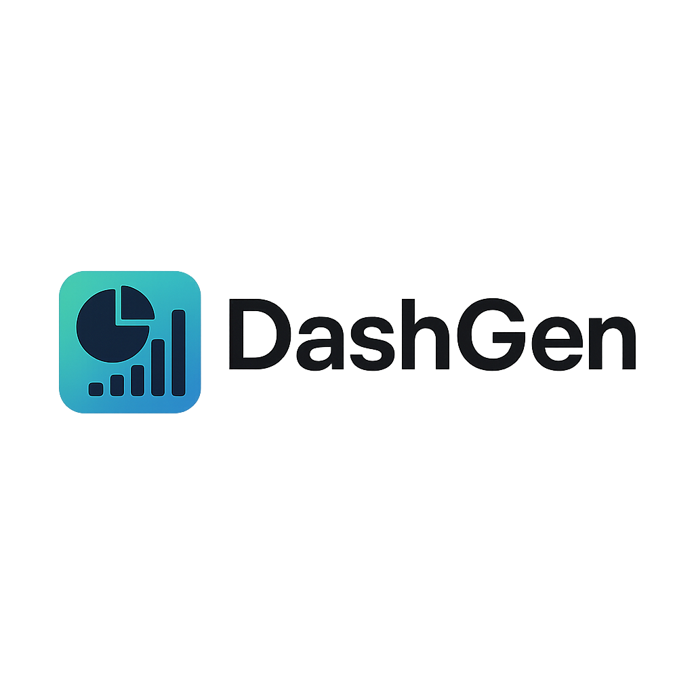

# 📊 DashGen

<p align="center">
  
</p>

<h1 align="center">DashGen - AI Dashboard Generator</h1>

<p align="center">
  Create stunning, interactive dashboards from your data in seconds. Upload CSV, JSON, or Excel files and watch AI build beautiful visualizations with intelligent insights.
</p>

<p align="center">
  <a href="#features">Features</a> •
  <a href="#tech-stack">Tech Stack</a> •
  <a href="#getting-started">Getting Started</a> •
  <a href="#usage">Usage</a> •
  <a href="#contributing">Contributing</a>
</p>

---

## ✨ Features

### 🤖 AI-Powered Analysis
- **Smart Data Understanding**: AI analyzes your data structure and recommends optimal visualizations
- **Business Context Detection**: Automatically identifies data patterns (sales, analytics, HR, etc.)
- **Intelligent Chart Selection**: Suggests best chart types based on data types and relationships

### 📈 Advanced Visualizations
- **Interactive Charts**: Line, bar, pie, scatter, area, histogram, and funnel charts
- **KPI Cards**: Automated metric calculations with trend analysis
- **Real-time Filtering**: Dynamic data filtering and sorting capabilities
- **Responsive Design**: Works perfectly on desktop, tablet, and mobile

### 💾 Data Integration
- **Multiple Formats**: Support for CSV, JSON, Excel (.xlsx/.xls) files
- **Smart Parsing**: Automatic data type detection and validation
- **Memory System**: Learns from successful dashboard patterns
- **Error Handling**: Comprehensive data quality assessment

### 🎨 Modern UI/UX
- **Dark/Light Themes**: Seamless theme switching
- **Live Code Preview**: Real-time dashboard generation
- **Gradient Design**: Beautiful, modern interface
- **Accessibility**: Built with accessibility standards

## 🛠️ Tech Stack

- **AI Models**: Llama 3.1 405B for high-quality code generation
- **LLM Inference**: [Together AI](https://together.ai) for fast, reliable AI responses
- **Frontend**: Next.js 15 with React 19 and TypeScript
- **Styling**: Tailwind CSS with Radix UI components
- **Code Sandbox**: Sandpack for live code preview and execution
- **Database**: PostgreSQL with Prisma ORM (Neon serverless)
- **File Processing**: Papa Parse (CSV), SheetJS (Excel)
- **Data Visualization**: Recharts, Chart.js integration
- **Authentication**: Built-in session management
- **Deployment**: Vercel-ready with edge runtime support

## 🚀 Getting Started

### Prerequisites

- Node.js 18+ and npm
- PostgreSQL database (or Neon serverless)
- Together AI API key

### Installation

1. **Clone the repository**
   ```bash
   git clone https://github.com/4mohdisa/dashgen.git
   cd dashgen
   ```

2. **Install dependencies**
   ```bash
   npm install
   ```

3. **Set up environment variables**
   Create a `.env` file in the root directory:
   ```env
   # Required: Together AI API key
   TOGETHER_API_KEY=your_together_ai_api_key_here
   
   # Required: Database connection
   DATABASE_URL=your_postgresql_database_url_here
   
   # Optional: For file uploads (if using S3)
   S3_UPLOAD_KEY=your_s3_key
   S3_UPLOAD_SECRET=your_s3_secret
   S3_UPLOAD_BUCKET=your_s3_bucket
   S3_UPLOAD_REGION=your_s3_region
   
   # Optional: For analytics
   HELICONE_API_KEY=your_helicone_key
   ```

4. **Set up the database**
   ```bash
   npx prisma generate
   npx prisma db push
   ```

5. **Start the development server**
   ```bash
   npm run dev
   ```

6. **Open in your browser**
   Navigate to `http://localhost:3000`

## 📖 Usage

### Basic Dashboard Creation

1. **Start with a Prompt**
   - Describe what kind of dashboard you want
   - Example: "Create a sales dashboard with revenue trends and KPI cards"

2. **Upload Your Data (Optional)**
   - Click the "Data" button to upload CSV, JSON, or Excel files
   - AI will automatically analyze your data structure
   - Intelligent recommendations will be generated

3. **AI Generation**
   - Click the generate button
   - Watch as AI creates a complete dashboard with:
     - Interactive charts and visualizations
     - KPI cards with real calculations
     - Filtering and sorting capabilities
     - Responsive design

4. **Customize and Export**
   - Review the generated code
   - Make adjustments if needed
   - Export or deploy your dashboard

### Data File Formats

**CSV Example:**
```csv
date,revenue,customers,region
2024-01-01,10000,50,North
2024-01-02,12000,60,South
```

**JSON Example:**
```json
[
  {"date": "2024-01-01", "revenue": 10000, "customers": 50, "region": "North"},
  {"date": "2024-01-02", "revenue": 12000, "customers": 60, "region": "South"}
]
```

### AI Prompting Tips

- **Be Specific**: "Create a financial dashboard with revenue trends and expense breakdown"
- **Include Context**: "Build an e-commerce analytics dashboard for monthly sales data"
- **Specify Features**: "Generate a dashboard with KPI cards, line charts, and filtering options"
- **Data-Aware**: When uploading data, AI automatically understands your structure

## 🧩 API Endpoints

### File Upload
```http
POST /api/upload-data
Content-Type: multipart/form-data

Form Data:
- file: [CSV|JSON|Excel file]
```

### Data Import
```http
POST /api/import-data
Content-Type: application/json

{
  "fileId": "string",
  "fileName": "string"
}
```

## 🔧 Configuration

### Environment Variables

| Variable | Description | Required |
|----------|-------------|----------|
| `TOGETHER_API_KEY` | Together AI API key for LLM inference | ✅ |
| `DATABASE_URL` | PostgreSQL connection string | ✅ |
| `S3_UPLOAD_KEY` | AWS S3 access key for file uploads | ❌ |
| `HELICONE_API_KEY` | Helicone API key for observability | ❌ |

### Customization

- **Themes**: Modify `tailwind.config.ts` for custom color schemes
- **Models**: Update `lib/constants.ts` to change AI models
- **Components**: Extend `components/ui/` for custom UI elements

## 🤝 Contributing

We welcome contributions! Please see our [Contributing Guide](CONTRIBUTING.md) for details.

### Development Setup

1. Fork the repository
2. Create a feature branch: `git checkout -b feature/amazing-feature`
3. Make your changes and test thoroughly
4. Commit with conventional commits: `git commit -m "feat: add amazing feature"`
5. Push to your branch: `git push origin feature/amazing-feature`
6. Open a Pull Request

### Code Standards

- TypeScript for type safety
- ESLint + Prettier for code formatting
- Conventional commits for clear history
- Comprehensive testing for new features

## 📝 License

This project is licensed under the MIT License - see the [LICENSE](LICENSE) file for details.

## 🙏 Acknowledgments

- Together AI for powerful LLM infrastructure
- Vercel for seamless deployment platform
- Radix UI for beautiful, accessible components
- The open-source community for inspiration and tools

## 📧 Contact

**Mohammed Isa**
- GitHub: [@4mohdisa](https://github.com/4mohdisa)
- Twitter: [@4mohdisa](https://twitter.com/4mohdisa)

## 🌟 Star History

If you find DashGen useful, please consider giving it a star! ⭐

---

<p align="center">
  Made with ❤️ by <a href="https://github.com/4mohdisa">Mohammed Isa</a>
</p>